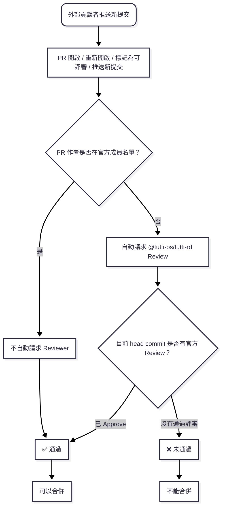

# 為 Tutti 做貢獻

[English](CONTRIBUTING.md) | [简体中文](CONTRIBUTING.zh-CN.md) | [繁體中文](CONTRIBUTING.zh-TW.md)

感謝你有興趣為 Tutti 做貢獻！本指南涵蓋開發環境設定、專案規範，以及讓你的變更順利合併所需的資訊。

參與本專案即表示你同意遵守我們的[行為準則](CODE_OF_CONDUCT.md)。

> 註：本程式碼庫使用內部代號 `tutti`，你會在目錄與二進位檔命名中看到它（如 `services/tuttid`）。

## 儲存庫結構

- `apps/desktop`：Electron 桌面外殼、renderer UI、preload 橋接層和原生桌面整合
- `services/tuttid`：長駐本機的常駐服務，核心業務邏輯所在
- `packages/clients/*`：共用的領域用戶端
- `packages/configs/*`：共用的工程設定
- `packages/ui/*`：共用的視覺系統邊界

## 開發環境

建議的本機環境：

- Node.js `24` 或更高；`.node-version` 固定了專案基線
- pnpm `10.11.0`
- Go `1.24`
- `golangci-lint` `v2.12.0`

安裝 workspace 相依套件：

```sh
pnpm install
```

對於新建的連結 Git worktree，請改用：

```sh
pnpm setup:worktree
```

這個命令會安裝 workspace 相依套件，接著在平行測試執行前預熱 Electron。它會重用
共享的 Electron 下載快取，並將執行環境解壓縮到新 worktree；不會重用其他
worktree 的 `Electron.app`。

安裝固定版本的 `golangci-lint`：

```sh
pnpm install:golangci-lint
```

檢查本機環境：

```sh
pnpm setup:dev
```

以包含前置檢查和預先建置 `tuttid` 的方式啟動桌面應用程式開發：

```sh
make dev-gui
```

如果你已有可用的 daemon 二進位檔，只想執行原本的 Electron/Vite 開發流程，`pnpm dev:desktop` 仍然可用。

## 常用指令

```sh
make dev-gui
pnpm build
pnpm typecheck
pnpm lint
pnpm lint:ts
pnpm lint:go
pnpm test:ts
pnpm test:go
pnpm check:golangci-version
pnpm install:golangci-lint
pnpm generate:defaults
pnpm check:defaults-generated
```

完整驗證入口：

```sh
pnpm check:full
```

## 儲存庫規則

- daemon 產品邏輯歸屬 `services/tuttid`，provider-neutral agent 生命週期歸屬 `packages/agent/host`
- UI 與桌面整合歸屬 `apps/desktop`
- 只有存在真實共用邊界時，程式碼才應進入 `packages/`
- 業務程式碼檔案應保持在 `800` 行以內；超過即為重構訊號

深入參考：

- 架構總覽：[docs/architecture/README.md](docs/architecture/README.md)
- 專案結構：[docs/architecture/project-structure.md](docs/architecture/project-structure.md)
- 儲存庫約定：[docs/conventions/README.md](docs/conventions/README.md)
- 靜態分析與 lint 規則：[docs/conventions/static-analysis.md](docs/conventions/static-analysis.md)
- Agent 貢獻者說明：[AGENTS.md](AGENTS.md)

## 提交規範

我們遵循 [Conventional Commits](https://www.conventionalcommits.org/)：

```
<type>(<scope>): <subject>
```

本儲存庫中的範例：

```
fix(workspace-files): avoid protected directory prefetch
fix(agent): preserve provider permission defaults
```

常用類型：`feat`、`fix`、`docs`、`refactor`、`test`、`chore`。

## 開發者原創證書（DCO）

我們要求貢獻者簽署 [Developer Certificate of Origin](https://developercertificate.org/)。這是一份輕量聲明，表示你有權依照本專案的授權條款（Apache-2.0）提交貢獻。

用 `-s` 參數為每個 commit 加上簽署：

```sh
git commit -s -m "feat(scope): add something"
```

這會在 commit message 末尾加上一行 `Signed-off-by: Your Name <your@email>`。

## Pull Request 流程

1. Fork 儲存庫並從 `dintal-dock` 建立分支。建議的分支命名：`feat/...`、`fix/...`、`docs/...`
2. 完成你的變更；每個 PR 只聚焦一件事
3. 送出 PR，清楚描述動機與變更內容
4. CI 會根據變更檔案執行相關的 TypeScript、Go、套件和工具檢查；所有選取的檢查必須通過
5. 維護者會 review 你的 PR；請回應回饋，並把討論保留在 PR 中

本機鉤子使用 `husky`：

- `pre-commit` 執行暫存區格式化和 UI 邊界檢查
- `pre-push` 透過 `pnpm check:changed -- --push-ready` 執行變更感知的推送檢查

## Pull Request 評審門禁

Tutti 使用 `external-pr-review-gate` workflow 區分內部團隊變更和外部貢獻。官方作者由組織變數 `TUTTI_RD_MEMBERS` 定義；GitHub 團隊 `tutti-rd` 是外部 PR 的 review 請求目標。

- `tutti-rd` 成員發起的 PR 不會自動請求 reviewer，也不需要額外官方 approve 即可通過評審門禁
- 非 `tutti-rd` 作者發起的 PR 會自動請求 `@tutti-os/tutti-rd` review
- 外部 PR 只有在目前 head commit 獲得 `tutti-rd` 成員 approve 後才能合併
- 推送新提交會刷新門禁；新的 head commit 需要重新獲得通過評審
- 官方團隊成員變更時，維護者必須同時更新 `TUTTI_RD_MEMBERS` 和 `tutti-rd` 團隊



## 文件語言策略

- `README.*` 和 `CONTRIBUTING.*` 以英文、簡體中文、繁體中文三種語言維護
- **英文版是唯一基準（source of truth）**——修改 `README.md` 或 `CONTRIBUTING.md` 時，須在同一個 PR 中同步更新 `*.zh-CN.md` 和 `*.zh-TW.md`
- 譯文與英文版衝突時，以英文版為準
- `LICENSE`、`NOTICE`、`CODE_OF_CONDUCT.md`、`SECURITY.md` 與 `docs/` 目錄只維護英文

## 回報問題

- Bug 回報與功能請求：使用 [issue 模板](.github/ISSUE_TEMPLATE)
- 安全漏洞：**請勿提交公開 issue**——參見 [SECURITY.md](SECURITY.md)

## 授權

向 Tutti 提交貢獻，即表示你同意你的貢獻以 [Apache License 2.0](LICENSE) 授權釋出。

> 翻譯說明：本文件與英文版內容同步，如有出入，以[英文版](CONTRIBUTING.md)為準。

## 功能與缺陷交付 SOP

1. 明確目標、非目標、約束、使用者旅程和驗收標準（Intent）。缺陷記錄重現條件、預期與實際行為。
2. 透過 [AGENTS](AGENTS.md) 與 [STYLE](STYLE.md) 定位職責和適用規範（Policy）。變更聚焦目前任務，保留無關未提交變更，依功能邊界準備提交。
3. 隨實作交付行為 / 整合測試，包括關鍵失敗與恢復路徑；缺陷修復配套捕捉原問題的回歸案例。
4. 效能敏感路徑交付 benchmark，明確負載、並行量、計時邊界、指標和比較條件；不適用時說明原因。
5. 按 [Validation Selection](docs/conventions/testing.md#validation-selection) 選擇檢查。如實說明通過、失敗、略過與未執行項目；缺少可比較基準或預算時不宣稱效能達標。
6. 更新 current / next、決定與原因、剩餘阻礙（State），關聯測試、重現與執行結果（Evidence），遵循[知識模型](docs/README.md#knowledge-model)。

根 `integration-tests/` 管理跨模組行為情境，根 `benchmarks/` 管理效能情境和負載。單元測試與實作相鄰；依賴套件私有成員或專屬夾具的既有測試保留套件內實作，由根目錄登記，不為搬移測試擴大正式 API。

行為測試斷言可觀察結果；benchmark 保留正確性斷言並在可比較環境重複取樣。可重用測試和夾具隨原始碼交付；執行證據標明版本、環境、命令與結果，原始輸出關聯任務 / CI 產物，依知識模型選擇需要保留的證據。

## 可執行流程與發布交接

- `bash integration-tests/run.sh --list`：選擇行為套件。
- `bash benchmarks/run.sh --list`：選擇效能套件。
- `pnpm check:changed`：變更範圍驗證；`pnpm check:full`：完整驗證。選擇與重試細節由 [Testing](docs/conventions/testing.md) 維護。
- Git hooks：[Local Git Hooks](docs/conventions/local-git-hooks.md)；靜態分析：[Static Analysis](docs/conventions/static-analysis.md)。
- Worker 派遣：[DeepSeek workers](docs/conventions/deepseek-workers.md)。

既有腳本、套件命令和 hooks 是可執行 SOP，修改時同步文件，不增加平行包裝。新增執行階段 / 環境變數約定寫入所屬規範；HTTP 契約變更先改 `services/tuttid/api/openapi/tuttid.v1.yaml` 並遵循 [API contracts](docs/conventions/api-contracts.md)。

開發分支與獲准推送的預設目標為 `dintal-dock` / `origin/dintal-dock`，使用者另行指定時依其要求。push、PR、rebase 和發布依任務授權執行。使用者要求建立的 PR 採 ready-for-review 狀態、英文標題和中文描述；建立或更新後讀回草稿狀態、標題、描述編碼、head commit 與 CI 狀態。

解決衝突前先理解雙方意圖，涉及職責邊界的內容手動合併；沒有明確要求時不整側覆蓋。確認無未解決路徑，並按合併後的行為選擇檢查。

使用者可見變化透過所屬發布流程更新 release notes / changelog：[Desktop releases](docs/conventions/desktop-release.md) 或 [npm package releases](docs/conventions/npm-package-release.md)。沿用既有版本、tag 和評審門禁，不另建一套發布流程。
